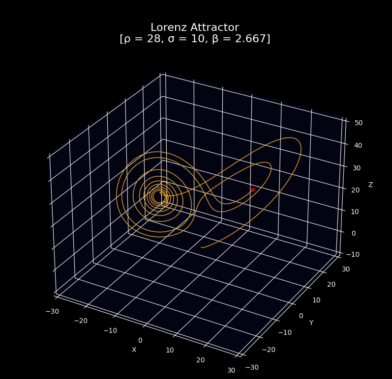

# About this project
A script to plot, animate, or generate frames for the Lorenz attractor using matplotlib

## Example output

<p align="center">
  
</p>


## :hammer_and_wrench: Setup/ Preparation
```bash
pipenv install --ignore-pipfile --skip-lock --python 3.9
pipenv shell
```
If faced by `UserWarning: Matplotlib is currently using agg, which is a non-GUI backend, so cannot show the figure.`
```bash
sudo apt-get install python3.9-tk
```

## :rocket: Usage examples:

#### Script options
```bash
python lorenz_attractor.py -h

  -h, --help     show this help message and exit
  -n , --steps   Frame/step count to simulate
  -r , --ro      ρ value of attractor
  -s , --sigma   σ value of attractor
  -b , --beta    β value of attractor
  -a, --animate  Animate flag
  -f, --frames   Save frames flag
```

#### Plot the lorenz attractor for the first 5000 frames
```bash
python lorenz_attractor.py -n 5000
```
#### Animate the lorenz attractor over time for the first 5000 frames
```bash
python lorenz_attractor.py -n 5000 -a
```
#### Save individual frames as images to animate using external tools
```bash
python lorenz_attractor.py -n 5000 -f
```
